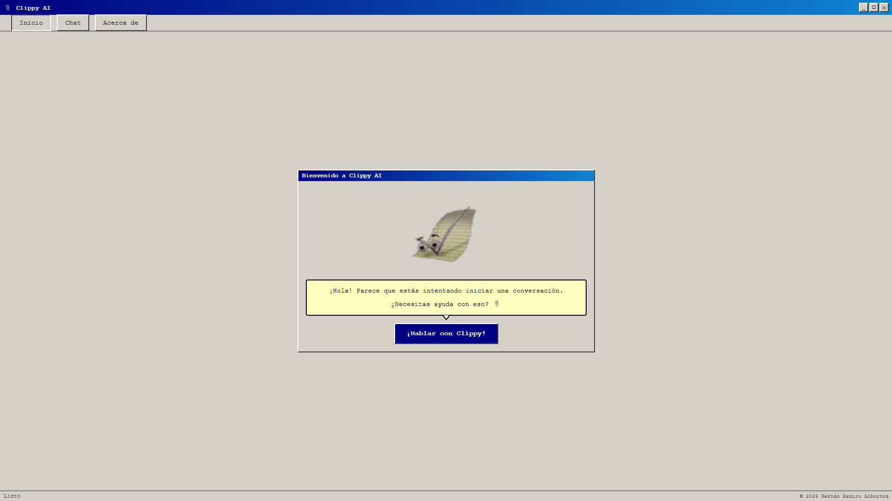
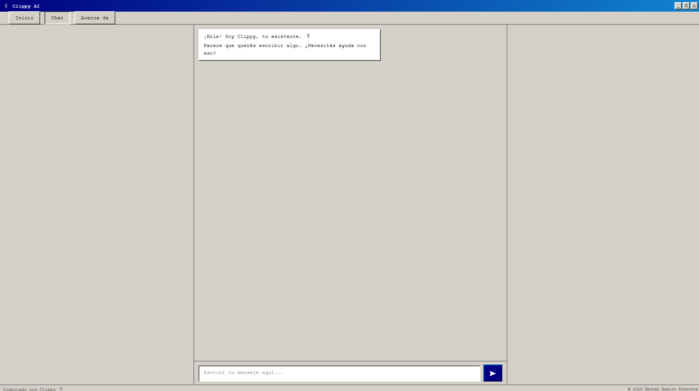
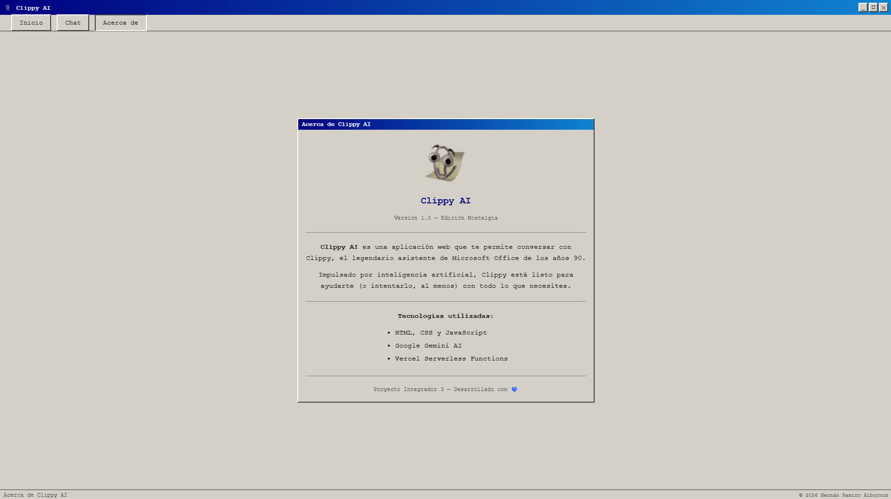

# 📎 Clippy AI


Una Single Page Application (SPA) que te permite conversar con **Clippy**, el legendario asistente de Microsoft Office de los años 90, potenciado por inteligencia artificial.


---

## 🌐 Demo en producción

🔗 [Ver aplicación en Vercel](https://proyecto-m3-hernan-ramiro-albornoz.vercel.app/)

---

## 📋 Descripción

Clippy AI es una SPA desarrollada con Vanilla JavaScript que integra Google Gemini AI para simular conversaciones con Clippy. El personaje mantiene su personalidad característica: entrometido, excesivamente entusiasta y siempre queriendo ayudar, aunque nadie se lo haya pedido.

### Características principales

- 💬 Chat en tiempo real con Clippy usando Google Gemini 2.5 Flash
- 🗺️ Navegación SPA con History API (sin recargas de página)
- 📱 Diseño responsive mobile-first con estética retro Windows 98
- 🎭 23 animaciones originales de Clippy con rotación automática
- 🔒 API key segura mediante Vercel Serverless Functions
- ⚡ Manejo de errores, estados de carga y retry automático
- 🧪 88 tests unitarios con 100% de cobertura en utils.js

---

## 🛠️ Tecnologías utilizadas

| Tecnología | Uso |
|------------|-----|
| HTML5, CSS3, JavaScript | Frontend (Vanilla JS, sin frameworks) |
| Google Gemini 2.5 Flash | Inteligencia artificial |
| Vercel Serverless Functions | Backend seguro (proxy de la API) |
| Vercel | Deploy y hosting |
| Vitest | Tests unitarios |

---

## 📁 Estructura del proyecto

```
clippy-ai/
│
├── api/
│   └── functions.js          # Serverless Function — proxy seguro a Gemini
│
├── src/
│   ├── assets/
│   │   └── clippy-white-*.gif # 23 animaciones originales de Clippy
│   ├── index.html             # Único HTML de la SPA
│   ├── styles.css             # Estilos retro Windows 98 (mobile-first)
│   ├── app.js                 # Routing SPA con History API
│   ├── chat.js                # Lógica del chat y comunicación con la API
│   └── utils.js               # Funciones utilitarias reutilizables
│
├── tests/
│   ├── utils.test.js          # Tests de funciones puras y transformación
│   ├── app.test.js            # Tests de routing y fetch con mocking
│   └── dom.test.js            # Tests de funciones DOM con jsdom
│
├── .env                       # Variables de entorno locales (no subir a Git)
├── .env.example               # Ejemplo de variables de entorno
├── .gitignore                 # Archivos ignorados por Git
├── package.json               # Dependencias y scripts
├── package-lock.json          # Versiones exactas de dependencias (generado por npm)
├── vercel.json                # Configuración de Vercel
└── README.md                  # Este archivo
```

---

## ⚙️ Instalación y ejecución local

### Requisitos previos

- [Node.js](https://nodejs.org) v18 o superior
- Cuenta en [Vercel](https://vercel.com)
- API key de [Google AI Studio](https://aistudio.google.com)

### Pasos

**1. Clonar el repositorio:**

```bash
git clone https://github.com/tu-usuario/clippy-ai.git
cd clippy-ai
```

**2. Instalar dependencias:**

```bash
npm install
```

**3. Configurar variables de entorno:**

```bash
cp .env.example .env
```

Editá el archivo `.env` y agregá tu API key de Gemini:

```
GEMINI_API_KEY=tu_api_key_aqui
```

Para obtener una API key gratuita:
1. Ir a [Google AI Studio](https://aistudio.google.com)
2. Click en **"Get API Key"**
3. Copiar la key y pegarla en el `.env`

**4. Iniciar sesión en Vercel** *(solo la primera vez)*:

```bash
vercel login
```

**5. Correr el proyecto localmente:**

```bash
vercel dev
```

La app estará disponible en: `http://localhost:3000`

---

## 🧪 Tests

### Correr todos los tests:

```bash
npm run test:run
```

### Correr tests en modo watch (se re-ejecutan al guardar):

```bash
npm test
```

### Correr tests con reporte de cobertura:

```bash
npm run test:coverage
```

El reporte visual se genera en la carpeta `coverage/`. Abrí `coverage/index.html` en el navegador para verlo.

### Resultado actual de los tests:

```
✅ tests/app.test.js   — 24 tests
✅ tests/utils.test.js — 52 tests
✅ tests/dom.test.js   — 12 tests
─────────────────────────────────
Total: 88 tests pasando

Coverage de utils.js:
% Stmts:  100%
% Branch: 100%
% Funcs:  100%
% Lines:  100%
```

---

## 💡 Decisiones técnicas

| Decisión | Alternativa considerada | Razón |
|----------|------------------------|-------|
| Gemini 2.5 Flash | Gemini 1.5 Flash | Mejor calidad de respuestas y modelo más reciente |
| Vanilla JS | React / Vue | Requisito del proyecto (sin frameworks) |
| `mix-blend-mode: multiply` | GIFs con fondo transparente | Los GIFs originales tienen fondo blanco |
| Temperature 1.2 | Temperature 1.0 | Respuestas más creativas y variadas para Clippy |
| Historial limitado a 20 mensajes | Historial ilimitado | Controlar el consumo de tokens y el costo |
| Serverless Function como proxy | Llamada directa a Gemini | Proteger la API key en el servidor |
| jsdom en tests DOM | Ignorar funciones DOM | Alcanzar 100% de cobertura en utils.js |

---

## 🔑 Variables de entorno

| Variable | Descripción | Requerida |
|----------|-------------|-----------|
| `GEMINI_API_KEY` | API key de Google Gemini AI | ✅ Sí |

Para configurar localmente copiá `.env.example` como `.env` y completá el valor:

```bash
cp .env.example .env
```

Para configurar en producción agregá la variable en el dashboard de Vercel en **Settings → Environment Variables**.

---

## ⚠️ Limitaciones conocidas

- El historial de conversación **se pierde al recargar la página** — es el comportamiento esperado según el enunciado del proyecto. El historial vive en memoria JavaScript y se borra al recargar. Esto además **reduce el costo de tokens** ya que cada nueva sesión empieza sin historial previo.
- El historial está limitado a los últimos **20 mensajes** por request para controlar el consumo de tokens
- Las respuestas están limitadas a **300 tokens** (~200 palabras) para mantener respuestas cortas y controlar costos
- En el plan gratuito de Gemini el límite es **15 requests por minuto** — si se supera, el retry automático espera y reintenta

---

## 🚀 Deploy en Vercel

### Deploy automático (recomendado)

1. Subí el repositorio a GitHub
2. Entrá a [vercel.com](https://vercel.com) y conectá el repositorio
3. En el dashboard de Vercel, configurá la variable de entorno:
   - **Nombre:** `GEMINI_API_KEY`
   - **Valor:** tu API key de Gemini
4. Vercel hace el deploy automáticamente en cada push a `main`

### Deploy manual desde la terminal

```bash
vercel --prod
```

---

## 🔒 Seguridad

La API key de Gemini **nunca** se expone en el frontend. El flujo seguro es:

```
Usuario → Frontend → Serverless Function → Gemini AI
                     (API key aquí, en el servidor)
```

El archivo `.env` está incluido en `.gitignore` y nunca se sube al repositorio.

---

## 🎮 Cómo usar la app

1. **Home** — Pantalla de bienvenida con Clippy animado
2. **Chat** — Escribí cualquier mensaje y presioná Enter o el botón ➤
3. **About** — Información sobre el proyecto y las tecnologías

### Tips para chatear con Clippy

- Saludalo para ver su reacción entusiasta
- Preguntale sobre tecnología moderna (smartphones, Netflix, etc.)
- Intentá ignorarlo o ser grosero — nunca pierde el entusiasmo
- Preguntale si es una IA 😄

---

## 📸 Capturas de pantalla

### Vista Home


### Vista Chat


### Vista About


---

## 🤖 Sobre el uso de IA en el desarrollo

Este proyecto fue desarrollado con asistencia de Claude (Anthropic) como herramienta de apoyo.

### Prompts utilizados

- Diseño del system prompt de Clippy con personalidad, tono y comportamientos específicos
- Implementación del routing SPA con History API
- Estrategia de rotación de GIFs con crossfade
- Manejo de errores 429 con retry automático
- Configuración de tests unitarios con Vitest y cobertura con v8

### Decisiones tomadas a partir de las respuestas

- Se eligió **Gemini 2.5 Flash** sobre 1.5 Flash por mejor calidad de respuestas
- Se implementó **temperature 1.2** para respuestas más creativas y variadas
- Se limitó el historial a **20 mensajes** para controlar el consumo de tokens
- Se usó **`mix-blend-mode: multiply`** para integrar los GIFs con fondo blanco
- Se separaron los tests DOM en un archivo dedicado con entorno jsdom

---

## 👨‍💻 Autor

**Hernán Ramiro Albornoz**

Proyecto Integrador 3 — Henry Bootcamp

---

## 📄 Licencia

Este proyecto es de uso educativo.

---

*© 2026 Hernán Ramiro Albornoz*